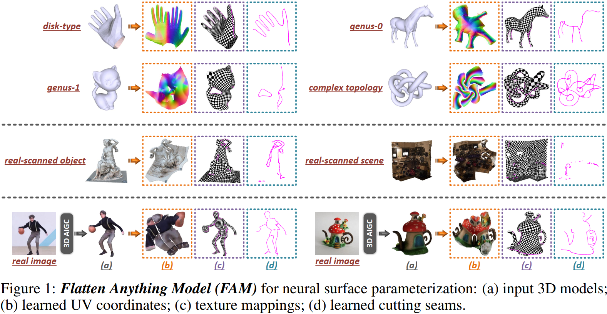
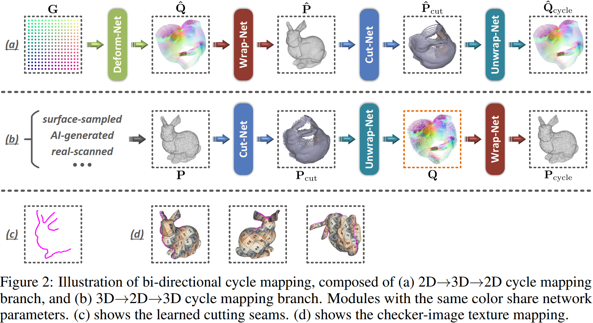

# Flatten Anything: Unsupervised Neural Surface Parameterization (NeurIPS-2024)

This is the official implementation of **[[Flatten Anything Model (FAM)](https://arxiv.org/abs/2405.14633)]**, an unsupervised neural architecture for global free-boundary surface parameterization.

<p align="center">  </p>

<p align="center">  </p>


### Configuration

```bash
conda create -n fam python==3.9
conda activate fam
pip install torch==2.3.1 torchvision==0.18.1 torchaudio==2.3.1 --index-url https://download.pytorch.org/whl/cu121
pip install -r requirements.txt
```

Note that in ```util/custo_knn_cpu``` the k-NN operator is pre-compiled for Python 3.9, hence you need to specify this specific Python version when creating conda environment so that you can directly use it. Or you can refer to [the original implementation](https://github.com/QingyongHu/RandLA-Net/tree/master/utils/nearest_neighbors) for compilation on your own setup.

### Instruction

In case that there are some problems with your input mesh, you can use the ```clean_mesh()``` function in ```util/funcs.py``` to clean it up in advance.

**Training:** Specify the number of input points and training iterations.
```bash
python train_mesh.py "./example/input_model/test_model.obj" "./exported" 10000 10000
```
For unoriented point clouds, you can simply input ```normals=None``` into the ```train_fam()``` and ```test_fam()``` functions in ```util/workflow.py```, which will disable the calculation of the normal cosine similarity loss term.

**Testing**
```bash
python test_mesh.py "./example/input_model/test_model.obj" "./exported/test_model/fam.pth" "./example/checker_map/20x20.png" "./exported/test_model" "mesh_verts"
```
You can also perform testing on points sampled from mesh by specifying the ```input_format``` and ```"--N_poisson_approx``` arguments.

### Citation

If you find our work useful in your research, please consider citing:

    @inproceedings{zhang2024flatten,
        title={Flatten Anything: Unsupervised Neural Surface Parameterization},
        author={Zhang, Qijian and Hou, Junhui and Wang, Wenping and He, Ying},
        booktitle={Proc. NeurIPS},
        year={2024}
    }
